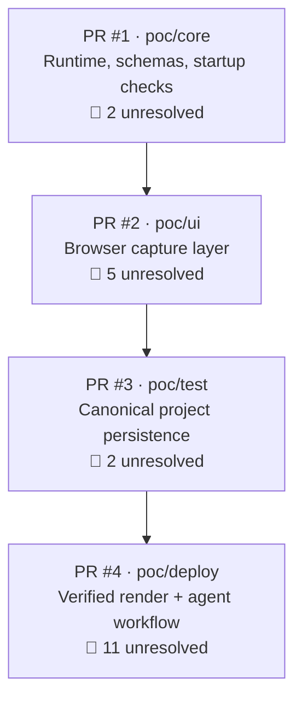

# Replex POC — Open PR Review Report

> **Generated:** 2026-09-06 · **Repository:** [maybemnv/Replex](https://github.com/maybemnv/Replex) · **Stack:** `poc/core ⊂ poc/ui ⊂ poc/test ⊂ poc/deploy`

All 4 open PRs form a **stacked branch series** implementing the Release Replay POC end-to-end. Each PR has been self-reviewed by the author (`maybemnv`) and auto-reviewed by Codex. Both initial and re-review rounds were conducted. **No PR is merge-ready** — every PR has blocking findings remaining after the latest fix push.

---

## Stack Overview

---

## PR #1 — [POC Core: runtime, schemas, and startup checks](https://github.com/maybemnv/Replex/pull/1)

**Branch:** `poc/core` → `main` · **Files:** 8 (+2203) · **Status:** 🔴 2 blocking findings remain

### What it does
Bootstraps the POC core runtime: typed CLI entry (`src/cli.ts`), Zod schema foundation (`src/schema.ts`), and executable preflight checks (tool versions + bundled Chromium startup probe). This is the bottom of the stacked series.

### Fix push summary
Origin normalization via `normalizeOrigin`, `BrowserStep` per-action validation, `Flow` unique-ID and order-contiguity checks, defensive `tryParseUrl`, Chromium probe error mapping, `--help`/`--config=path` handling, signal and truncated output in failure detail, `.catch` on entrypoint, timezone fix. Tests: 12 passed, tsc clean.

### Unresolved Issues

| # | Severity | File | Issue | Why it matters |
|---|----------|------|-------|----------------|
| 1 | **P2** | [`src/cli.ts`](file:///D:/Projects/AI-Agents-and-LLM/Replex/src/cli.ts) | **CLI error codes collapsed to `CLI_ERROR`** — `errorPayload()` maps every ordinary `Error` to `CLI_ERROR`, discarding typed codes like `CLI_USAGE_ERROR`, `CONFIG_READ_FAILED`, `CONFIG_INVALID_JSON`. | Callers cannot distinguish structured failure modes the code explicitly constructs. The fix is to preserve an attached string `code` property and use `CLI_ERROR` only as fallback. |
| 2 | **P2** | [`src/cli.ts`](file:///D:/Projects/AI-Agents-and-LLM/Replex/src/cli.ts) (L103) | **Startup probes accept any exit-0 executable** — A zero exit status sets `available: true` without requiring a Chromium/FFmpeg/ffprobe version signature. `/bin/true` satisfies the preflight. | Defers real tool-missing failures to later work stages. Fix: validate expected tool signature string before marking available. |

### Resolved
- ✅ Non-throwing malformed URL validation (`normalizeOrigin` + `tryParseUrl`)

---

## PR #2 — [POC Capture: approved browser flow evidence](https://github.com/maybemnv/Replex/pull/2)

**Branch:** `poc/ui` → `poc/core` · **Files:** 6 (+1100) · **Status:** 🔴 5 blocking findings remain

### What it does
Full browser-capture layer: approved Playwright flows, immutable source evidence fingerprinting, run trace retention, source scene splitting/probing, first-failure diagnostics, operator auth state, trust boundaries, and safety gates — including retaining auditable failed attempts.

### Fix push summary
Prohibited-action check no longer trusts the `consequential` flag, runtime `failure.message` redacted, `validateCapturePlan` with Zod parsing mapped to typed errors, `sceneKey` validated as stable ID, unknown actions throw, `waitFor` explicit no-op, missing `valueRef` throws, console events capped at 1000, scene-boundary epsilon clamp, ffmpeg/ffprobe timeouts, locator fixes. Tests: 26 passed, tsc clean.

### Unresolved Issues

| # | Severity | File | Issue | Why it matters |
|---|----------|------|-------|----------------|
| 1 | **P1** | [`src/capture.ts`](file:///D:/Projects/AI-Agents-and-LLM/Replex/src/capture.ts) | **Visible checkpoints can self-satisfy** — When a checkpoint's `target.name` or `value` equals `expected`, the observed-state array includes the declaration itself. A `testId: "status"` checkpoint with `expected: "status"` passes even if the browser shows something completely different. | Incorrect states get recorded as verified evidence. Fix: exclude declared target metadata from the observed state array. |
| 2 | **P1** | [`src/capture.ts`](file:///D:/Projects/AI-Agents-and-LLM/Replex/src/capture.ts) | **Browser init outside retained-attempt lifecycle** — `chromium.launch()`, `newContext()`, tracing/page setup happen before the main `try/finally`. Failures here produce no failed `run.json` or action log and can leak browser processes. | Violates failed-attempt retention guarantees. Fix: put browser/context/page initialization under the same lifecycle. |
| 3 | **P1** | [`src/capture.ts`](file:///D:/Projects/AI-Agents-and-LLM/Replex/src/capture.ts) | **Failure screenshots can mask original error** — If `page.screenshot()` rejects (page crashed/closed) while handling the original error, it exits the catch before evidence/logs/trace/`run.json` are written. | Replaces an actionable `CaptureRunError` with a screenshot error. Fix: make diagnostic collection best-effort with try/catch. |
| 4 | **P2** | [`src/capture.ts`](file:///D:/Projects/AI-Agents-and-LLM/Replex/src/capture.ts) (L198) | **Runtime origin checks compare non-canonical strings** — Schema-level origins are normalized, but capture runtime still uses raw `allowedOrigins.includes(...)` against canonical `new URL(...).origin`. Trailing slash/default-port forms pass schema but fail capture. | Origin mismatches at runtime despite valid schema. Fix: use shared normalized-origin comparison. |
| 5 | **P2** | [`src/capture.ts`](file:///D:/Projects/AI-Agents-and-LLM/Replex/src/capture.ts) (L237) | **Noncontiguous scene-key reuse accepted** — A flow with keys `A, B, A` keeps first-insertion order but updates A's checkpoint to the final action, then `deriveSceneBoundaries` throws only after all browser actions have run. | Wasted execution and confusing errors. Fix: validate each scene key forms one contiguous block before browser execution. |

### Resolved
- ✅ Persisted failure-message redaction (no more credential leakage via Playwright error messages)

---

## PR #3 — [POC Project: canonical identity and revisions](https://github.com/maybemnv/Replex/pull/3)

**Branch:** `poc/test` → `poc/ui` · **Files:** 4 (+586) · **Status:** 🔴 2 blocking findings remain

### What it does
Atomic stable revision persistence plus a strict canonical v1 manifest with identity and hash coverage. Deliberately narrow persistence PR between the capture layer and the finishing stack.

### Fix push summary
`writeRevision` retry is idempotent after interrupted commit, `canonicalJson` uses codepoint sort, `loadProject` verifies via `verifyProject` and rejects tampered manifests, `ProjectSchema` checks scene actionIds/checkpoint/order, scene range vs capture duration, and recaptureLineage references. New tests: retry-after-interrupt and tampered-manifest rejection. Tests: 15 passed, golden hash unchanged.

### Unresolved Issues

| # | Severity | File | Issue | Why it matters |
|---|----------|------|-------|----------------|
| 1 | **P1** | [`src/project.ts`](file:///D:/Projects/AI-Agents-and-LLM/Replex/src/project.ts) | **Absolute capture paths rejected** — `normalizeCapture()` rejects absolute `sourcePath`, but `runCapture` with an absolute `artifactRoot` returns absolute paths. PR #3 has no adapter to relativize. PR #4 mitigates at integration, but #3 isn't independently merge-green. | The PR cannot land standalone in the stack. Fix: normalize paths at this boundary or accept the adapter from #4 first. |
| 2 | **P1** | [`src/project.ts`](file:///D:/Projects/AI-Agents-and-LLM/Replex/src/project.ts) | **Capture identity trusts caller-supplied IDs** — Distinct immutable captures can alias if a caller reuses an `id`. `runCapture` returns a fingerprint but no capture ID, forcing integration code to invent one. | Reruns and recapture lineage can alias distinct media. Fix: derive IDs from capture fingerprint/provenance or reject mismatches. |

### Resolved
- ✅ Interrupted revision retry (idempotent `writeRevision` when orphaned snapshot already exists)

---

## PR #4 — [POC Delivery: verified render and bounded agent workflow](https://github.com/maybemnv/Replex/pull/4)

**Branch:** `poc/deploy` → `poc/test` · **Files:** 17 (+4437) · **Status:** 🔴 11 blocking findings remain (9 original + 2 new)

### What it does
The "finishing stack": deterministic operation reducer, verification, rendering, bounded inspection tools, agent model integration (Gemini 3.8 Flash), agent tool loop, evaluation harness, reconciliation, dynamic/difficult fixtures, report generation, and CLI commands. This is the **hard blocker** for the entire stack.

### Fix push summary
`writeEvaluation` honors caller `evidenceRoot`, `runRecordedAgentDraft` enforces edit+verify+render completion gate, Windows dirname fix removed, `reconcileCapture` streaming hash in 1MB chunks, capture SHA-256 restored to `fingerprintCapture` with provenance, ffprobe timeout, CLI flags. Tests: agent+evaluation 12 passed, wider suite 55 passed/4 skipped, tsc clean.

### Unresolved Issues

| # | Severity | File | Issue | Why it matters |
|---|----------|------|-------|----------------|
| 1 | **P1** | [`src/project.ts`](file:///D:/Projects/AI-Agents-and-LLM/Replex/src/project.ts) (L62) | **Capture FPS hard-coded to 30** — `capturesFromRun()` declares `fps: 30` without converting the source clip or using the probed rate. `probeVideo()` measures actual FPS but doesn't propagate it into the capture record. | Fresh captures from non-30fps sources immediately fail `CAPTURE_MEDIA` verification, and recapture rejects the mismatch. |
| 2 | **P1** | [`src/project.ts`](file:///D:/Projects/AI-Agents-and-LLM/Replex/src/project.ts) (L62) | **Fresh captures ineligible for duration target** — Each raw browser clip keeps its real-time duration (often seconds), but verification requires 25–35s and slowest speed is only 0.75×. Integration tests hide this by separately looping/normalizing clips. | A normal `capture` command result cannot be verified, rendered, or edited. The production path needs deterministic duration normalization. |
| 3 | **P1** | [`src/agent.ts`](file:///D:/Projects/AI-Agents-and-LLM/Replex/src/agent.ts) (L179) | **Edit tool schemas incomplete** — `toolInputSchema()` publishes only `baseRevisionId` and `evidenceRefs` with `additionalProperties: true`. Tool-specific fields (`sceneId`, `speed`, `focus`, `overlay`) are undisclosed. | Model must guess private reducer shapes; schema-conforming calls get rejected. Real Claude/Gemini tool calling will fail systematically. |
| 4 | **P1** | [`src/operations.ts`](file:///D:/Projects/AI-Agents-and-LLM/Replex/src/operations.ts) (L389) | **Project commits non-atomic with operation-log writes** — `persistAccepted()` writes revision + `project.json` before parsing/appending to `operations.jsonl`. A log write failure returns `PERSISTENCE_ERROR` after canonical state has already advanced. | Unaudited or partially audited batches with false failure results. Fix: stage or roll back all writes as one commit boundary. |
| 5 | **P1** | [`src/render.ts`](file:///D:/Projects/AI-Agents-and-LLM/Replex/src/render.ts) (L63) | **Render authorization has TOCTOU gap** — `executeRenderJob()` checks that verification exists/passed/has expected ID, but does not recompute `job.sha256`, compare `job.revisionSha256` with manifest, or re-hash source files. | A stale/tampered render job or modified source can execute against a previously verified but now-changed revision. |
| 6 | **P1** | [`src/verify.ts`](file:///D:/Projects/AI-Agents-and-LLM/Replex/src/verify.ts) (L58) | **Capture fingerprint vs raw-media SHA mismatch** — Capture layer stores `sha256` via `fingerprintCapture(bytes, provenance)` (media + provenance JSON hash), but verifier compares against `sha256File(path)` (raw media bytes only). | Fresh captures **always** fail `CAPTURE_HASH` verification by construction. Fix: separate fields for media SHA and provenance fingerprint, or use one identical hash contract. |
| 7 | **P1** | [`src/verify.ts`](file:///D:/Projects/AI-Agents-and-LLM/Replex/src/verify.ts) (L152) | **Unclosed EOF freeze detection** — Parser only treats `black_duration` or `freeze_duration` as failures. FFmpeg `freezedetect` can emit only `freeze_start: 0` with no `freeze_duration` when frozen through EOF. | A completely frozen clip passes `CAPTURE_BLANK_FREEZE`. Fix: track freeze_start/freeze_end and close open intervals at EOF. |
| 8 | **P2** | [`src/verify.ts`](file:///D:/Projects/AI-Agents-and-LLM/Replex/src/verify.ts) (L80) | **Crossfade overlap ignored in duration verification** — Verifier sums full scene durations while renderer subtracts crossfade overlap. A 25s project with 500ms crossfade verifies but renders 24.5s, which `assertRenderedMedia` rejects. | Verification and rendering disagree at the duration boundaries. Fix: use one shared transition-adjusted duration calculation. |
| 9 | **P2** | [`src/render.ts`](file:///D:/Projects/AI-Agents-and-LLM/Replex/src/render.ts) (L220) | **Focus effects ignore timing** — `focusFilters()` ignores `focus.startMs`/`endMs`; both drawbox and crop/zoom apply for the entire scene. | Accepted focus timing edits render incorrectly — focus appears for the whole scene. |
| 10 | **P2** | [`src/agent.ts`](file:///D:/Projects/AI-Agents-and-LLM/Replex/src/agent.ts) (L197) | **Fabricated evidence references accepted** — `validEvidence()` is regex-only validation. An edit citing `capture:does-not-exist` passes and is persisted as grounding evidence. | Defeats the evidence boundary — model choices appear grounded without matching artifacts. Fix: track handles from prior inspections and require membership. |
| 11 | **P2** | [`tests/integration/agent-draft.test.ts`](file:///D:/Projects/AI-Agents-and-LLM/Replex/tests/integration/agent-draft.test.ts) (L14) | **Media tests silently skip on PATH installs** — `existsSync("ffmpeg")` is false on normal PATH-only installations, so the entire integration suite skips silently while `npm test` reports green. | All media integration coverage is skipped without warning. Fix: probe executability through PATH or `spawnSync`. |

---

## Cross-Cutting Themes

### 🔒 Evidence Integrity
Multiple issues compromise the trustworthiness of evidence — the core value proposition of this POC:
- Checkpoints self-satisfying from metadata (PR #2)
- Capture hash mismatch between producer/verifier (PR #4)
- Fabricated evidence references accepted (PR #4)
- Render authorization TOCTOU gap (PR #4)

### ⚡ Duration/FPS Contract
The capture-to-render pipeline has systemic duration and FPS issues:
- Raw browser clips too short for the 25–35s target (PR #4)
- FPS hard-coded to 30 without normalization (PR #4)
- Crossfade overlap ignored in verification (PR #4)

### 🧩 Stack Integration
The stacked PR structure creates dependencies:
- PR #3 rejects absolute capture paths that PR #2 produces; PR #4 mitigates at integration but #3 isn't self-contained
- Capture identity trusts caller-supplied IDs (PR #3), mitigated differently in #4

### 🤖 Agent Readiness
The agent tool loop cannot function correctly:
- Edit tool schemas are incomplete — model must guess fields (PR #4)
- Evidence references aren't validated against actual disclosures (PR #4)

---

## Summary: Unresolved Findings by Severity

| Severity | Count | PRs affected |
|----------|-------|--------------|
| **P1** | 12 | #1(0), #2(3), #3(2), #4(7) |
| **P2** | 8 | #1(2), #2(2), #3(0), #4(4) |
| **Total** | **20** | All 4 PRs |

> [!IMPORTANT]
> **None of the 4 PRs are merge-ready.** The re-review on the latest head of each branch confirmed that the majority of original findings persist. PR #4 is the critical blocker as it owns the end-to-end capture → project → agent → verify → render path and carries 11 unresolved findings including 7 P1s.
