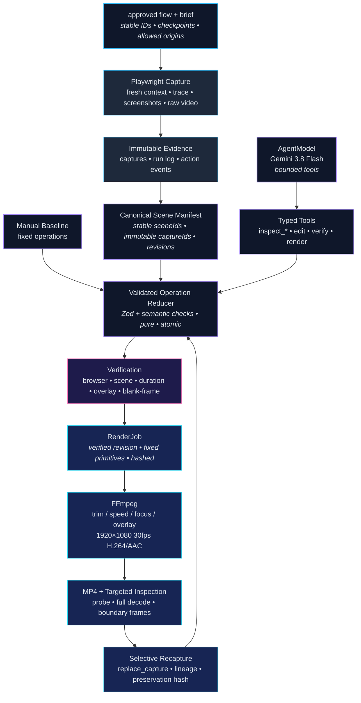

# Replex — Release Replay

> **Playwright flow + feature brief → reproducible, editable release video.** When the product changes, recapture only the affected scene — not the whole video.

**Status:** Local POC only. Disposable evidence for hypothesis validation, not a production foundation. See [`Docs/PRD.md`](Docs/PRD.md) and [`Docs/poc/technical_poc.md`](Docs/poc/technical_poc.md).

---

## What it proves

Two independent hypotheses against three adversarial browser apps (normal, dynamic, difficult):

**A — Reproducible compilation:** an approved flow deterministically reaches declared states, produces 3–5 immutable captures, maps them to stable scenes, accepts validated edits, verifies invariants, renders via FFmpeg, and replaces one affected capture without changing unrelated state.

**B — Agentic editing:** one configured model inspects bounded evidence, invokes only typed tools, creates a valid revision, and renders a useful draft. Text alone does not count — accepted tool calls and a verified MP4 do.

Pass requires: 5/6 flows complete without intervention, 100% checkpoint correctness, 3/3 selective recaptures preserve unrelated sources/edits, 9/9 valid renders (1920×1080, 30fps, 25–35s), median correction <10m, and no safety/privacy breach. See `Docs/PRD.md:17`.

---

## Architecture



The manifest revision is authoritative. The model proposes; tools validate; the reducer mutates; verification authorizes; the renderer translates a `RenderJob` to fixed FFmpeg argv. No model-authored shell, JS, or filtergraph.

Full constraints: `Docs/poc/technical_poc.md:5-6`. Production direction (gated): `Docs/production/prod_stack.md`.

---

## Repository structure

```text
src/
  cli.ts          # command parsing / orchestration only
  capture.ts      # approved-flow runner, evidence collection
  project.ts      # schemas, load, atomic revisions, stable IDs
  operations.ts   # validated pure reducer — sole mutation boundary
  agent.ts        # one-method model seam, bounded tool loop
  verify.ts       # browser / scene / recapture / render checks
  render.ts       # RenderJob -> argv -> FFmpeg/ffprobe
  inspect.ts      # bounded inspection views
  reconcile.ts    # selective recapture and preservation asserts
  report.ts       # static report.html
fixtures/
  apps/normal/    # App A — normal SaaS workflow
  apps/dynamic/   # App B — authenticated async + modal/dropdown/toast
  apps/difficult/ # App C — wizard + file upload + slow validation
  operator.ts     # deterministic operator helpers
tests/            # Vitest — unit, integration, golden, browser, render
Docs/
  PRD.md, Architrure.md, DIFFUSION_STUDIO_TAKEAWAYS.md
  poc/technical_poc.md, poc/task.md, poc/implementation-plan.md, poc/FIXTURE_CATALOG.md
  production/prod_stack.md
```

Module boundaries: `Docs/poc/technical_poc.md:7`. Work artifacts are gitignored under `projects/` and `work/`.

---

## Prerequisites

- Node.js `>=22`
- npm (lockfile committed) — `technical_poc` notes `pnpm` as gated production choice
- FFmpeg + ffprobe on `PATH` (versions recorded in preflight)
- Playwright bundled Chromium (`npx playwright install chromium`)

---

## Quick start

```bash
npm ci
npm run build        # tsc --noEmit
npm test             # vitest run
npm run cli -- --help
```

Preflight validates FFmpeg/ffprobe, Chromium, disk paths, origins, and approvals before any capture.

---

## CLI

```bash
npm run cli -- capture --help
npm run cli -- baseline --help
npm run cli -- agent-draft --help
npm run cli -- verify --help
npm run cli -- render --help
npm run cli -- recapture --help
npm run cli -- report --help
```

All time values are integer milliseconds. Unknown persisted/tool fields are rejected. See `Docs/poc/technical_poc.md:9`.

---

## Fixtures — Apps A / B / C

Each fixture exposes `flow.ts` (stable IDs, checkpoints, `sceneKey`), `reset.ts`, `change.ts`, and a `README.md` describing its complexity:

- **App A (normal):** navigation + form/control + visible result. See [`fixtures/apps/normal/`](fixtures/apps/normal/).
- **App B (dynamic):** authenticated flow, async loading, modal/dropdown/toast. `POST /__reset`, `POST /__change`, `POST /__failure?action=dynamic-load-async`. See [`fixtures/apps/dynamic/README.md`](fixtures/apps/dynamic/README.md).
- **App C (difficult):** wizard + file upload + slow validation. `POST /__reset`, `POST /__change`, `POST /__failure?action=difficult-run-validation`. See [`fixtures/apps/difficult/README.md`](fixtures/apps/difficult/README.md).

The common harness resets, runs twice, builds baseline and agent draft, changes one target state, recaptures one scene, verifies, renders, and emits the same result schema.

---

## Inspect → Edit → Verify → Render

```
INSPECT application, states, selectors, safety constraints
   → execute approved flow, capture trace/screenshots/video
   → create 3–5 stable scenes in minimal manifest
   → EDIT through validated fixed operations
   → VERIFY browser/media/timing/overlay/blank-frame invariants
   → RENDER one authoritative 30s MP4 via FFmpeg
   → human review + correction time
   → change one product state → recapture + replace only affected scene
   → verify preservation + render revised MP4
```

Editing tools are typed wrappers around `trim_scene`, `reorder_scene`, `replace_capture`, `set_focus`, `set_callout`, `set_title`, `set_speed`, `set_transition`. The agent never writes the manifest directly. Inspection is bounded and redacted — no secrets, raw storage state, or full trace. See `Docs/poc/technical_poc.md:15-17`.

---

## Verification

Checks before render: approved flow completed, every expected checkpoint reached, origins allowed, expected UI visible, no prohibited action, captures exist with matching hashes and probe success, ranges valid, scene keys/IDs unique, overlays safe, duration 25–35s, RenderJob primitives allowed, no blank/frozen interval, output probes to H.264/AAC 1920×1080 30fps and fully decodes. Recapture additionally proves unaffected semantic projections hash identically. Human decides story/pacing.

---

## Docs

| Doc | Purpose |
|-----|---------|
| [`Docs/PRD.md`](Docs/PRD.md) | Normative POC scope, requirements POC-01…POC-20, pass/fail gates |
| [`Docs/poc/technical_poc.md`](Docs/poc/technical_poc.md) | Minimal local architecture, data model, contracts |
| [`Docs/poc/implementation-plan.md`](Docs/poc/implementation-plan.md) | Spec for agentic workers |
| [`Docs/poc/task.md`](Docs/poc/task.md) | Dependency-ordered tasks POC-1…POC-15 |
| [`Docs/poc/FIXTURE_CATALOG.md`](Docs/poc/FIXTURE_CATALOG.md) | App definitions and expected metadata |
| [`Docs/DIFFUSION_STUDIO_TAKEAWAYS.md`](Docs/DIFFUSION_STUDIO_TAKEAWAYS.md) | Research basis for the compiler model |
| [`Docs/Architrure.md`](Docs/Architrure.md) | Early agent → media → edit → FFmpeg sketch |
| [`Docs/production/prod_stack.md`](Docs/production/prod_stack.md) | Gated production stack (Tauri 2 + file projects + Workers) |
| [`Docs/pr-review-report.md`](Docs/pr-review-report.md) | Stacked PR review — blocking findings per branch |

---

## Stacked branches

This repo uses a stacked PR series (do not squash history when reviewing):

```
main
 └─ poc/core      # runtime, schemas, startup checks
     └─ poc/ui        # browser capture, provenance, safety gates
         └─ poc/test      # canonical identity, revisions, persistence
             └─ poc/deploy    # operations, verify, render, agent, reconcile
```

Each branch targets its parent. Local worktrees live under `C:/tmp/Replex-poc-*`. Keep `node_modules` and `projects/` gitignored.

---

## POC tasks

Track via `Docs/poc/task.md`. Critical path: `POC-1 → POC-2 → … → POC-6` (first MP4) → `POC-9` (first agent draft) → `POC-12` (agent edits survive recapture) → `POC-13–POC-15` (adversarial evaluation and gate decision).

---

## License

Private POC. No license grant for external use.
